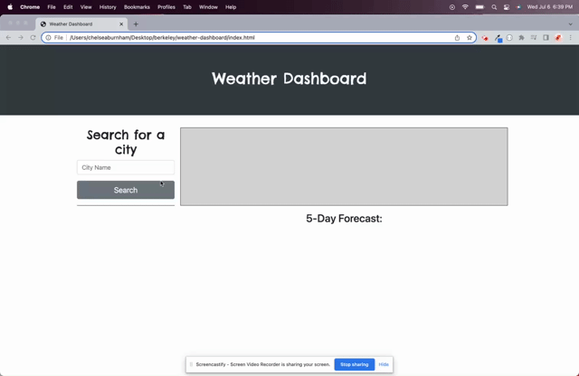

# weather-dashboard

##  Description
This site is a weather dashboard. It takes in 2 separate weather APIs to target the lat and lon by city name. Once a city name is typed into the search bar, the site will generate the current weather for that city including the temperature, wind speed, humidity, and UV Index. It will then generate a 5 day forecast with the same information (excluding UV Index). You will also be able to see an icon next to each day that is determined from the API's matching icon list. 

[Deployable Link](https://chelseaburnham.github.io/weather-dashboard/)

##  Installation
To install this project, fork the repository to your Github account.  
Once on your Github account, clone the repository to your local machine. 

##  Usage
You can use this to search for cites worldwide and find out the current weather for that city. You can also look at the next 5 day's forecast. This would be great for if you are planning a trip and would like to plan ahead.  
 
The UV Index changes to easily identify whether the condition is favorable, moderate, or severe.  

##  Credits
[w3schools](https://www.w3schools.com/) 
[Stack Overflow](https://stackoverflow.com/?newreg=8cd9776f072c449eac02d1ab363597c8) 

##  License
[MIT License](https://github.com/chelseaburnham/weather-dashboard/blob/c0bdc01012e49ef0a5cda7a0b19bb51609cf2dff/LICENSE)